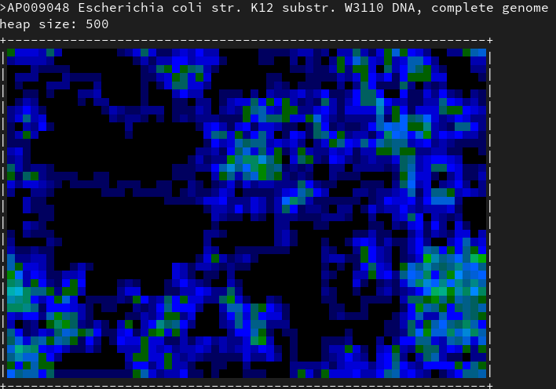

# Computing a Visual Representation of a Sequence

Minimizers and sketches are a well-known method to reduce a long sequence to a fixed-size set of k-mers. The [Snippets](snippets) section contains code to execute a function on every canonical k-mer. If these k-mers are hashed and stored in a heap, this is a representative representation of a sequence.

Tools like [Mash](https://github.com/marbl/Mash) use these sets to compare sequences. However, they can also be used to compute a visual representation of a sequence:

The idea is to apply the [drunken bishop algorithm](http://www.dirk-loss.de/sshvis/drunken_bishop.pdf) to the kmers stored in the heap. [The code](https://github.com/kloetzl/libdna/blob/master/examples/drunken.c) for this is rather simple. The above example uses a heap with 500 kmers (k=13) and a torus-shaped surface. Other parameters create other images. The same idea can also be used to create [other representations](https://twitter.com/kloetzl/status/1286662306022264832) of sequences.
